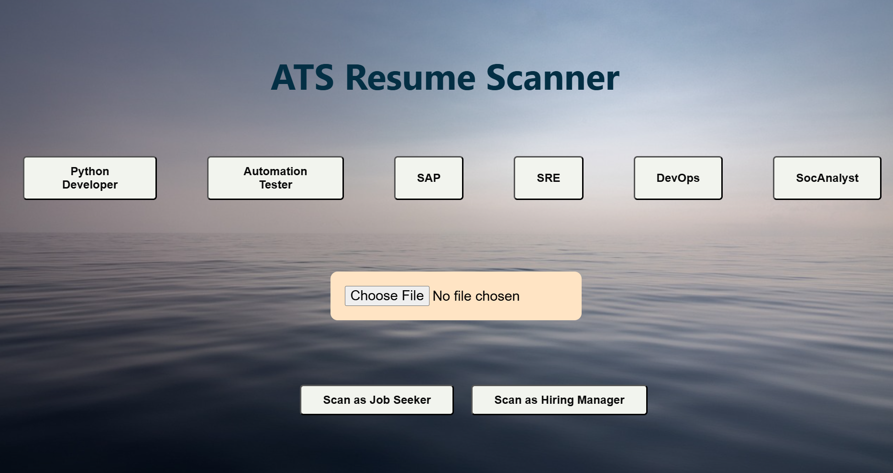
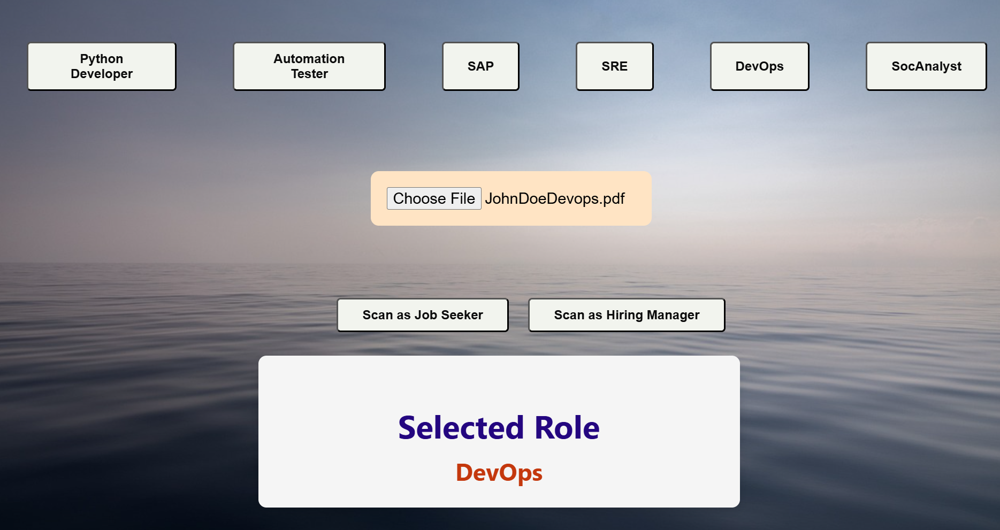
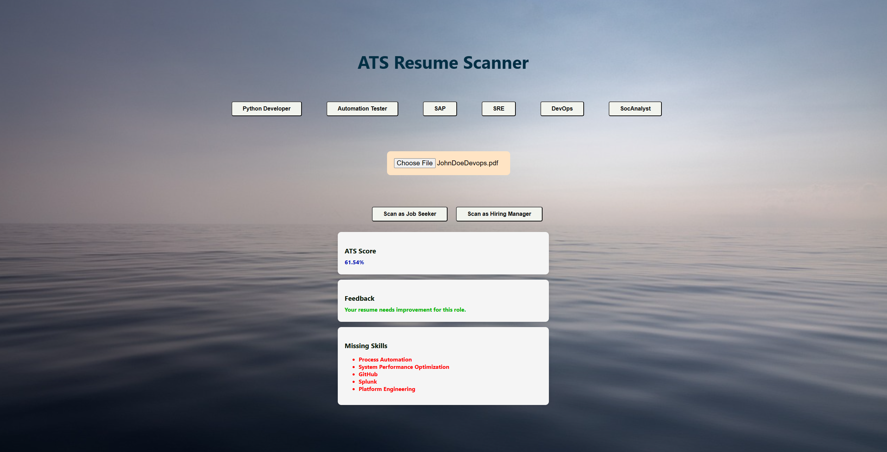
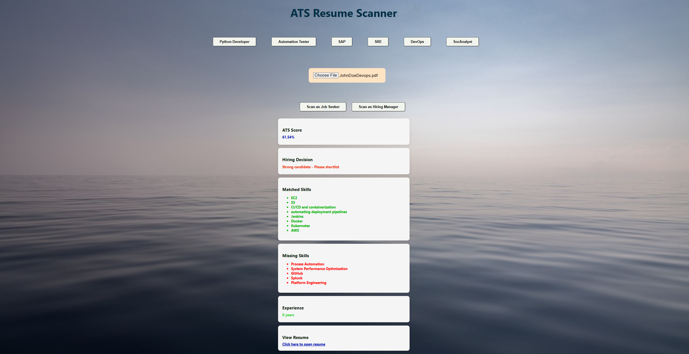

#  ATS Resume Scanner (Applicant Tracking System Resume Analyzer)
- An ATS Resume Scanner automatically analyzes and parses resumes using predefined rules and NLP techniques.
- It compares resume content with job descriptions to calculate ATS Scores
- The system helps recruiters efficiently shortlist the most relevant candidates with fair and consistent screening.

##  Objectives 
- Automate resume screening and candidate shortlisting using ATS logic
- Extract structured data from unstructured resume formats (PDF, DOCX)
- Match resumes with job descriptions using keyword
- Generate relevance-based match scores for each resume
- Rank candidates to support faster recruiter decision-making
- Scale efficiently to process large volumes of resumes

## Problem Statement 
- Recruiters receive a very large number of resumes for each job opening, making manual screening inefficient.
- Manual resume review is time-consuming, inconsistent, and can introduce bias.
- Many qualified candidates are rejected due to poor ATS optimization of resumes.
- There is a need for an automated system to parse resumes and extract key details such as skills, experience, and education.
- Matching resumes with job descriptions and generating suitability scores can improve hiring efficiency and consistency.

## Steps to achieve the targeted goal
- Create Frotend using html css 
- Use Javascript to make page interactive and add functionality.
- Work on backend by using flask to calculate ats score
- There are two button 
    - For Job Seeker 
        - Ats Score
        - Feedback
        - Missing Skills

    - For Highring Manager
        - Ats Score
        - Experience
        - Decision Of Highring
        - Strength
        - Weaknesses

# Detail Workflow
## 1.1 Folder Structure : 
```
    ATS-Resume-Scanner/
    │
    ├── Diagram/
    │   └── ATS-Resume.png
    │
    ├── docs/
    │   └── index.html
    │
    ├── skills/
    │   ├── developer.json
    │   ├── devops.json
    │   ├── sap.json
    │   ├── socanalyst.json
    │   ├── sre.json
    │   └── tester.json
    │
    ├── static/
    │   ├── script.js
    │   └── style.css
    │
    ├── templates/
    │   └── index.html
    │
    ├── uploads/
    │   ├── (Uploaded Resume PDFs)
    │
    ├── app.py
    ├── requirements.txt
    └── README.md

 ```

## 1.2  USER Interface : 
### Inside this project main focus is on following role : 
- Python developer
- Automation tester
- SAP
- SRE
- DevOps
- SocAnalyst

### Step 1:  Please  choose the role first.
### Step 2: Choose File PDF/DOCX
### Step 3: Select option according to need
    - Scan as Job Seeker
    - Scan as Hiring Manager


## Scenario After selecting any role  " ***DevOPs*** "
- After selecting role please choose resume PDF

- After this user have two options
    - If you are Job Seeker select   ``` Scan as JOB SEEKER ```
    - If You are Hiring Manager select ``` Scan as HIRING MANAGER```

# 1. Select Scan as Job Seeker : 
### "***Display***" 
    - ATS Score
    - Feedback for Job Seeker
    - Missing Skills for implevement



# 2. Select Scan as HIRING manager : 
### "***Display***" 

    - Display ATS Score
    - Hiring Decision
    - Matched Skills
    - Missing Skills
    - Experience
    - View Resume
    - Click here to open resume

