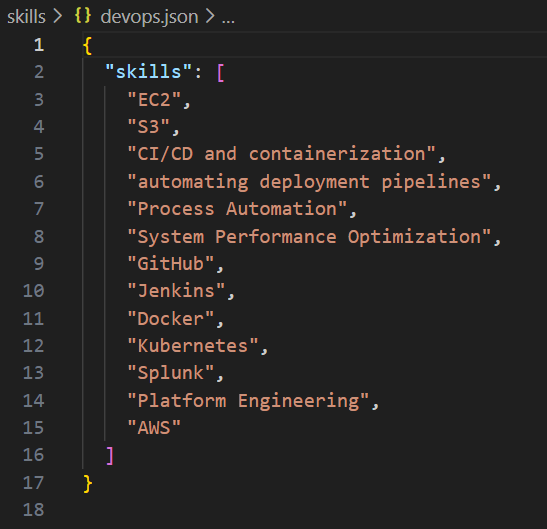
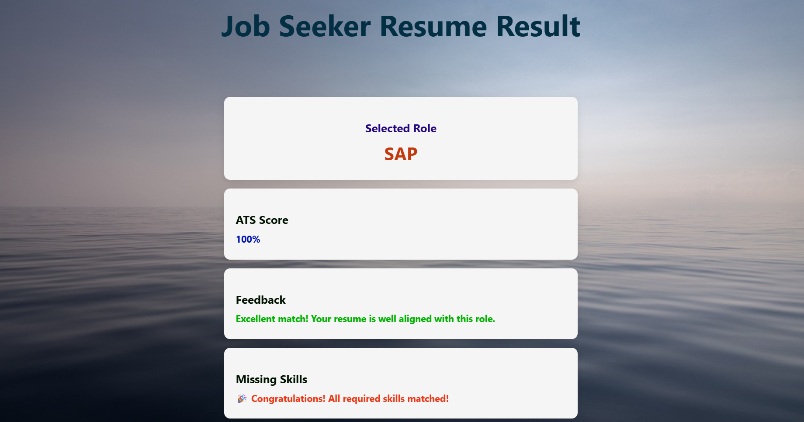
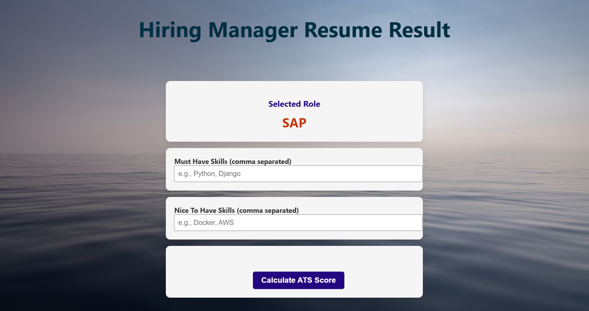
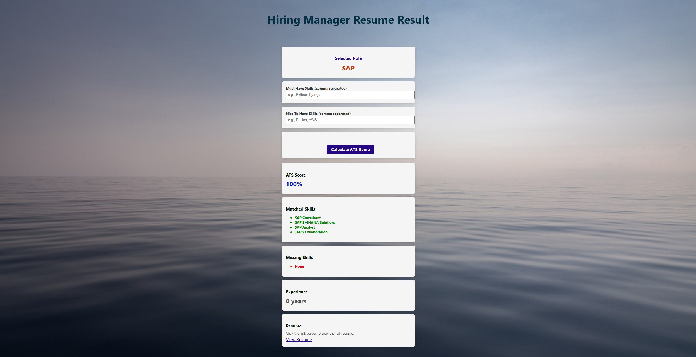
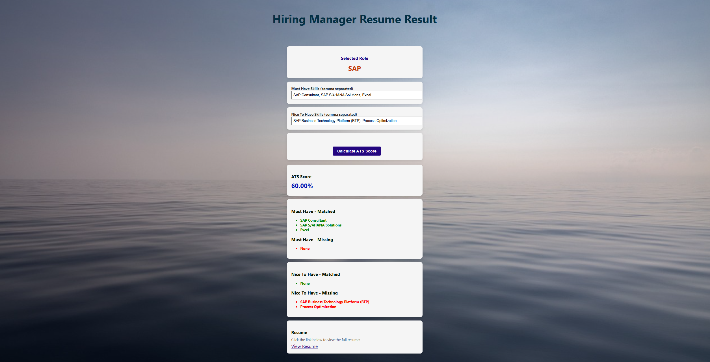

#  ATS Resume Scanner (Applicant Tracking System Resume Analyzer)
- An ATS resume scanne automatically analyzes and parses resumes using predefined rules and NLP techniques.
- It compares resume content with job descriptions to calculate ATS Scores
- The system helps recruiters efficiently shortlist the most relevant candidates with fair and consistent screening.

##  Objectives 
- Automate resume screening and candidate shortlisting using ATS logic
- Extract structured data from unstructured resume formats (PDF, DOCX)
- Match resumes with job descriptions using keywords
- Generate relevance-based match scores for each resume
- Rank candidates to support faster recruiter decision-making
- Scale efficiently to process large volumes of resumes

## Problem Statement 
- Recruiters receive a very large number of resumes for each job opening, making manual screening inefficient.
- Manual resume review is time-consuming, and inconsistent, and can introduce bias.
- Many qualified candidates are rejected due to poor ATS optimization of resumes.
- There is a need for an automated system to parse resumes and extract key details such as skills, experience, and education.
- Matching resumes with job descriptions and generating suitability scores can improve hiring efficiency and consistency.

## Steps to achieve the targeted goal
- Create frontend using HTML css 
- Use Javascript to make the pages interactive and add functionality.
- Work on the backend by using Flask to calculate the ATS score
- There are two button 
    - For Job Seekers 
        - ATS Score
        - Feedback
        - Missing Skills

    - For Hiring Manager
        - Ats Score
        - Experience
        - Decision Of Highring
        - Strength
        - Weaknesses

# Detail Workflow
## 1.1 Folder Structure : 
```

ATS-FRIENDLY-RESUME/
│
├── app.py
├── requirements.txt
├── README.md
│
├── image-1.png
├── image-2.png
├── image-3.png
├── image-4.png
├── image.png
│
├── Diagram/
│   ├── ATS-Resume-Version2.png
│   └── ATS-Resume.png
│
├── docs/
│   └── index.html
│
├── skills/
│   ├── developer.json
│   ├── devops.json
│   ├── sap.json
│   ├── socanalyst.json
│   ├── sre.json
│   └── tester.json
│
├── Specification/
│   ├── BackEnd/
│   │   └── README.md
│   └── FrontEnd/
│       └── README.md
│
├── static/
│   ├── script.js
│   └── style.css
│
├── templates/
│   ├── hiring_manager.html
│   ├── index.html
│   └── job_seeker_result.html
│
└── uploads/

 ```

## 1.2  User Interface : 
### Inside this project main focus is on following roles : 
- Python developer
- Automation tester
- SAP
- SRE
- DevOps
- SocAnalyst

### Step 1:  Please  choose the role first.
### Step 2: Choose File PDF/DOCX
### Step 3: Select option according to need
    - Scan as Job Seeker
    - Scan as Hiring Manager


## 1.3 Scenario After selecting any role  " ***DevOPs*** "
- After selecting the role please choose resume PDF

- After this user have two options
    - If you are Job Seeker select   ``` Scan as JOB SEEKER ```
    - If You are Hiring Manager select ``` Scan as HIRING MANAGER```

## 1.4 Skills 
- Create separate folder for skills
- ex. for "Devops" role
    - devops.json

    

## For detailed code related information, please go through below links
### For Frontend 

https://github.com/Shiwankar-Mrunal/ATS-FRIENDLY-RESUME/tree/main/Specification/FrontEnd

### For Backend

https://github.com/Shiwankar-Mrunal/ATS-FRIENDLY-RESUME/tree/main/Specification/BackEnd


# 1. Select Scan as Job Seeker : 
### "***Display***" 
    - ATS Score
    - Feedback for Job Seeker
    - Missing skills for improvement/ Congratulations message if all skills are matched




# 2. Select Scan as HIRING manager : 
### "***Display***" 




## For Job Seeker two input fields are provided 

- Must Have Skills
- Nice To Have Skils

## Output without input fields :

###  Same output for job seeker and Hiring Manager



## Output with Input fields :

### Output will based on skills matched




# Testing ATS Scanner For RealTime

| SR. NO |              SCENARIO                |       ROLE           | ATS SCORE     |  RESULT  |
|--------|--------------------------------------|----------------------|---------------|----------|
|   1    |  When user select role as developer  |  Python Developer    |     20%       |   Pass   |
|        |                                      |                      |               |          |
|   2    |   When user select role as Tester    |   Automation Tester  |     40%       |   Pass   |
|        |                                      |                      |               |          |
|   3    |   When user select role as SAP       |         SAP          |     100%      |   Pass   |
|        |                                      |                      |               |          |
|   4    |   When user select role as SRE       |         SRE          |     100%      |   Pass   |
|        |                                      |                      |               |          |
|   5    |  When user select role as Deveps     |       DevOps         |      61.54%   |   Pass   |
|        |                                      |                      |               |          |
|   6    |  When user select role as SocAnalyst |      SocAnalyst      |      80%      |   Pass   |


# Future Scope 
1) For multiple role add role.json file inside skills folder
2) Attached Database.